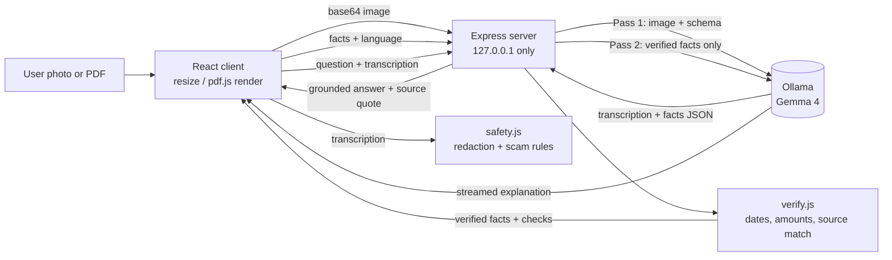

# DocSaathi

> A private, local AI assistant that reads a photo of an English document and explains it in Tamil, Hindi or simple English: what it is, what to do, by when, and how much. Nothing leaves your machine.

## Team

**Team Name:** [Team Name]


| Member | Contribution |
| ------ | ------------ |
| Hariharasudhan | Backend |
| Nithin Sai | Backend |
| Navikesh | AI |
| Shivadithya | Frontend |


## Problem Statement

### The Problem

Much of everyday Indian life runs on English paperwork: bank notices, electricity bills, insurance letters, rental agreements, scheme application forms, tax and legal notices. Many people who must act on these documents read only Tamil, Hindi or another regional language, or read English only partly.

Today they ask a shopkeeper, neighbour, agent or cyber-cafe operator to read the document for them, and often hand over Aadhaar, PAN, account numbers and personal letters in the process. Helpers can misread, summarise wrongly, or exploit the situation through extra fees, upselling or fraud. Deadlines and amounts get missed, which leads to penalties, lost scheme benefits, or signing something that was not understood. Fake notices ("your account will be blocked") are hard to tell apart from real ones.

Cloud AI apps and camera-translate tools require uploading sensitive documents to someone else's servers, and translation alone does not answer the questions people actually have: what do I do, by when, how much, and is this letter genuine?

### Why We Chose This Problem

People who cannot read English documents must choose between not understanding them and exposing their private data to strangers or the cloud. That is an unfair choice, and it affects ordinary people dealing with essential services. It is also a problem where open-weight AI is the right answer rather than a gimmick: the privacy promise ("your Aadhaar and bank letters never leave your machine") is only possible if the model runs locally. [Add a sentence on why this matters personally to your team.]

## Solution

DocSaathi turns a photo or PDF of an English document into a plain-language explanation in the reader's own language. Gemma 4 runs locally through Ollama on one laptop, reads the document image, extracts the key facts, and explains them. Plain code, not the model, checks every date and amount. Every fact is shown next to the exact words it came from, so the user can see where it came from.

The same laptop can be shared at a panchayat office, CSC or NGO desk, so helpers can explain documents without handing data to anyone.

### Key Features

- **Photo or PDF upload:** photos are resized in the browser; for PDFs the first page is rendered in the browser.
- **Action-first facts:** document type, sender, amount due, due date with days left, reference IDs, and what the reader must do.
- **Explanation in Tamil, Hindi or simple English:** short sentences, streamed as they are generated.
- **Evidence:** click a fact to highlight its exact source text in the transcription panel.
- **Grounded Q&A:** follow-up questions are answered only from the document, and the app says "This document does not say" when the answer is not there.
- **Honesty checks:** unreadable or unmatched facts trigger "Please check this against your paper copy."
- **Stretch features:** Aadhaar/PAN/phone/account redaction, scam check, read-aloud, and a downloadable .ics deadline reminder. [Keep only the ones that actually work at submission.]

## Innovation and Differentiation

- **Code handles facts, the model handles language.** The model reads and explains; deterministic code validates dates, amounts, days left, overdue status, and whether each quoted source really appears in the transcription. The model never decides these and never invents them.
- **Two-pass approach.** Pass 1 extracts structured facts with source quotes from the image. Pass 2 writes the Tamil or Hindi explanation from the verified facts only, which is more reliable than converting an image directly into Tamil.
- **Privacy enforced in code, not just promised.** The server refuses to start if the Ollama address is not local, binds to 127.0.0.1 only, never logs document content, and stores nothing.
- **Action over translation.** Existing camera-translate and cloud tools translate words. DocSaathi answers what to do, by when, and how much, with evidence and honest uncertainty.

## Technical Implementation

### Architecture



### Technology Stack


| Category        | Technologies                                                         |
| --------------- | -------------------------------------------------------------------- |
| Frontend        | React, Vite, plain CSS, pdf.js (pdfjs-dist)                          |
| Backend         | Node.js 18+, Express, cors, dotenv                                   |
| Database        | N/A (no server storage; optional history in browser localStorage)    |
| AI / ML         | Gemma 4 (`gemma4:e4b`, fallback `gemma4:e2b`) through Ollama         |
| Infrastructure  | Runs entirely on one local machine (Windows laptop)                  |
| APIs / Services | Local Ollama HTTP API only; no external services                     |


### How It Works

1. **Capture.** The browser accepts a photo or PDF. Images are resized to at most 1280 px; PDFs have page 1 rendered to an image with pdf.js. The image is sent as base64 to `POST /api/analyze`.
2. **Pass 1, understand.** The server asks Gemma 4 (vision) for the transcription and a structured JSON object: document type, sender, amount, due date, reference IDs, required actions and penalties, each with a `source_text` quote.
3. **Verify in code.** `verify.js` checks that dates are valid and plausible, computes days left and overdue status, checks the amount appears in its quote, and locates every quote inside the transcription. Any problem sets `needs_paper_check`.
4. **Pass 2, explain.** Only the verified facts go to the model, which writes a short explanation in Tamil, Hindi or simple English, streamed over Server-Sent Events from `POST /api/explain`.
5. **Display.** A split-pane view shows the transcription on one side and the facts and explanation on the other. Clicking a fact highlights its source by character offsets.
6. **Q&A.** `POST /api/ask` sends the transcription and the question; the model answers only from the document and ends with an exact `SOURCE` quote, which the server locates so the UI highlights only verified evidence.
7. **Safety extras.** `POST /api/redact` finds Aadhaar, PAN, phone and account numbers with regex; `POST /api/scam-check` combines deterministic rules with a model judgement; `POST /api/reminder` returns an .ics file.

| Endpoint | Purpose |
| --- | --- |
| `GET /api/health` | Is Ollama reachable and is the model installed |
| `POST /api/analyze` | Image in, facts + verification + transcription out |
| `POST /api/explain` (SSE) | Streamed explanation in `ta`, `hi` or `en` |
| `POST /api/ask` (SSE) | Streamed grounded answer + source span |
| `POST /api/scam-check` | Verdict, rule hits, reasons |
| `POST /api/redact` | Character spans of sensitive numbers |
| `POST /api/reminder` | Downloadable .ics deadline reminder |

### Technical Decisions

- **No OCR pipeline.** Gemma 4 vision reads the photo directly, which removes risky Windows installs (Tesseract, Poppler) and keeps the stack to one language.
- **No vector database or RAG.** One document fits easily in the model's context, so the full transcription is sent with each question.
- **Highlight text, not image regions.** Substring matching on the transcription is more reliable than image coordinates.
- **Fuzzy source matching.** Quotes are matched ignoring case, spacing and punctuation across all Unicode scripts, so Tamil and Devanagari work.
- **Rules can raise, never lower.** In the scam check, deterministic rules can raise the model's verdict but never lower it.
- **Local-only enforced.** The config module throws if `OLLAMA_HOST` is not localhost, and the server listens on 127.0.0.1 only.
- **Model size by hardware.** `gemma4:e4b` on 16 GB RAM or more, `gemma4:e2b` if the laptop is slow, chosen by a speed test (second run under about 45 seconds with correct amount and date).

## Implementation During the Hackathon

Everything in this repository was started and built during the Hack Day. The team used existing open-source libraries and the Gemma 4 model; the application, prompts, schema, verification engine, safety module, UI and integration were written by the team. The commit history shows the progression.

[Update this list at the end so it only describes what actually works:]

- Local server with Ollama client, health check and local-only enforcement
- Document analysis endpoint with structured extraction and retry on invalid JSON
- Deterministic verification engine with unit tests
- Streaming multilingual explanation (Tamil, Hindi, English)
- Grounded Q&A with source highlighting
- Redaction, scam check and calendar reminder [only if completed]
- React split-pane UI [describe]
- Evaluation on [N] fake sample documents, results in `docs/evaluation.md`

### Team Contributions

- **[Member Name]:** [Backend: server, Ollama client, verification engine, tests, endpoints]
- **[Member Name]:** [AI: prompts, schema, Tamil/Hindi quality, evaluation of extraction]
- **[Member Name]:** [Vision & Safety: sample documents, redaction, scam rules, accuracy report]
- **[Member Name]:** [Frontend: upload, pdf.js, split pane, highlighting, streaming UI, Q&A]

## Working Application

**Live Application:** N/A. DocSaathi is intentionally not deployed. Its privacy promise depends on running on the user's own machine, so there is no hosted version. To try it, follow the setup below, or watch the demo video.

[Briefly explain what can be tested after running locally: upload a sample from `samples/`, switch language, click a fact to see its source, ask a question, and try the scam sample.]

## Demo Video

**Demo Video:** [Video URL]

The video shows: the problem, turning Wi-Fi off, uploading a fake electricity bill, facts with days left, clicking the amount to see its source, switching between Tamil and Hindi, asking an answerable question and an unanswerable one ("This document does not say"), a scam notice, and Aadhaar redaction.

## Open Source and AI Usage

### AI / Models

- **Gemma 4 (`gemma4:e4b`, fallback `gemma4:e2b`), run locally with Ollama:** reads the document photo (vision transcription), extracts structured facts with source quotes, writes the Tamil / Hindi / simple English explanation, answers follow-up questions from the document only, and judges whether a letter looks like a scam. Model licence: [link to the Gemma 4 licence from its model page].

Code, not the model, does all date, amount, overdue and source verification, redaction, and calendar file generation.

### Open Source Components

- **Ollama:** local model runtime (MIT).
- **React and Vite:** frontend framework and build tool (MIT).
- **pdf.js (pdfjs-dist):** renders the first page of PDFs in the browser (Apache-2.0).
- **Express:** HTTP server (MIT).
- **cors:** localhost-only CORS handling (MIT).
- **dotenv:** environment variable loading (BSD-2-Clause).
- **Dataset:** no external dataset. All sample documents in `samples/` are fake and created by the team.
- **API / Service:** none external. The only network call is to the local Ollama API.

[Verify each licence against the package before submitting and add any package you added later.]

## Setup and Usage

### Prerequisites

- Node.js 18 or newer
- Git
- [Ollama](https://ollama.com) installed and running
- The Gemma 4 model pulled (`gemma4:e4b` for 16 GB RAM or more, `gemma4:e2b` for 8 GB); about 15 GB free disk
- Windows laptop with a charger connected and best-performance power mode recommended

### Installation

```bash
git clone [repository-url]
cd [project-directory]

# pull the model (confirm the exact tag with: ollama list)
ollama pull gemma4:e4b

# server
cd server
npm install
copy .env.example .env

# client (new terminal)
cd client
npm install
```

### Environment Variables

```env
PORT=3001
OLLAMA_HOST=http://127.0.0.1:11434
MODEL=gemma4:e4b
```

`OLLAMA_HOST` must be a local address; the server refuses to start otherwise. Use `MODEL=gemma4:e2b` on slower laptops.

### Running the Project

```bash
# terminal 1: server
cd server
npm run dev

# terminal 2: client
cd client
npm run dev
```

Open the address Vite prints (usually http://localhost:5173). To run the server tests: `cd server && npm test`.

### Usage

1. Open the app and confirm the health screen says Ollama and the model are ready.
2. Choose a language: Tamil, Hindi or Simple English.
3. Upload a photo or PDF of a document (use a file from `samples/`).
4. Wait while the document is read on your computer (the first run after starting can take longer).
5. Read the action-first facts and the explanation; click any fact to see its source text.
6. Ask follow-up questions; answers come only from this document.
7. Optional: hide private numbers, check if the notice is a scam, or download a calendar reminder.

Tip for demos: run a sample document twice before presenting so the model is warm.

## Devpost Submission

**Devpost Project:** [Devpost Project URL]

[Confirm the Devpost page has the description, links, screenshots, demo video and all four team members.]

## Evaluation

[Fill from `docs/evaluation.md` after testing on the fake sample set. Report real numbers, including failures.]

| Measure | Result |
| --- | --- |
| Sample documents tested | [N] |
| Document type correct | [x / N] |
| Amount correct | [x / N] |
| Due date correct | [x / N] |
| Source quotes located in transcription | [x / N] |
| Time per document (cold / warm) | [s / s] |
| Model and hardware | [gemma4 tag, laptop specs] |

## Limitations

- Accuracy depends on photo quality and the model; DocSaathi is a reading aid, not legal or financial advice. Serious matters should be confirmed with a bank, CSC or lawyer.
- Only the first page of a PDF is processed.
- The scam check is a signal, not a guarantee.
- Tamil and Hindi explanation quality is [reviewed by: name / not yet reviewed by a native speaker].
- Browser read-aloud needs a Tamil or Hindi voice installed on the computer.

## Challenges and Learnings

[Write the real ones at the end. Possible topics, delete what did not happen: getting structured output to work together with images in Ollama; making the model copy source quotes exactly; matching quotes across scripts; keeping Tamil and Hindi explanations short and faithful to the facts; speed of local inference and choosing E4B vs E2B.]

## Credits and License

### Credits

- Google's Gemma 4 open-weight model, and Ollama for local inference.
- React, Vite, pdf.js, Express, cors and dotenv and their maintainers.
- Hacktoberfest Hack Day Coimbatore 2026, organised by INIT Club and iDEA-Club with MLH.
- [Anyone who reviewed Tamil or Hindi output, tested the app, or helped.]

### License

MIT License. See [LICENSE](LICENSE). Gemma 4 is used under its own licence: [link].

## Submission Checklist

- [ ] Project title and description added
- [ ] All team members listed
- [ ] Problem clearly explained
- [ ] Reason for choosing the problem explained
- [ ] Solution and key features documented
- [ ] Innovation and differentiation explained
- [ ] Architecture included
- [ ] Technical implementation documented
- [ ] Work completed during the hackathon documented
- [ ] Team contributions documented
- [ ] Working application is functional
- [ ] Live application link added where applicable
- [ ] Demo video added
- [ ] AI and open-source components documented
- [ ] Setup and usage instructions tested
- [ ] Challenges and learnings documented
- [ ] Devpost submission completed
- [ ] Devpost link added
- [ ] Credits added
- [ ] License added
- [ ] Repository is organized and complete