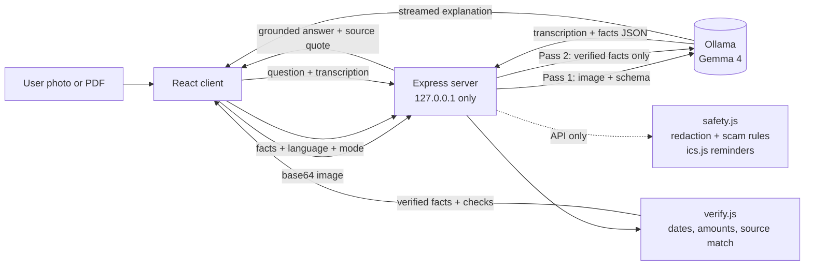

# DocSaathi

> A private, local AI assistant that reads a photo or PDF of an English document and explains it in your own language: what it is, what to do, by when, and how much. Nothing leaves your machine.

## Team

**Team Name:** Caffeine Coders

| Member | Contribution |
| ------ | ------------ |
| Hariharasudhan | Backend: local-only config, Ollama client with timeouts, extraction schema, analyze route, deterministic fact-verification engine, explain and ask streaming APIs, safety API (PII redaction and scam check), .ics reminders, backend tests and backend docs |
| Navikeshsaravanan | Frontend: the React application (uploader, fact verification cards, explanation panel with audio reader, document chat, transcription viewer, sample documents) |
| Nithin Sai | First Ollama and backend connection, port configuration, bug fixes and improved explanations |
| Shivaditya S S | Frontend-backend integration (API contract, streaming, language codes, port), nine languages and three modes, audio-reader voice selection, fixes to the scam check, calendar export and image handling, documentation, and the project README |

## Problem Statement

### The Problem

Much of everyday Indian life runs on English paperwork: bank notices, electricity bills, insurance letters, rental agreements, scheme application forms, tax and legal notices. Many people who must act on these documents read only Tamil, Hindi or another regional language, or read English only partly.

Today they ask a shopkeeper, neighbour, agent or cyber-cafe operator to read the document for them, and often hand over Aadhaar, PAN, account numbers and personal letters in the process. Helpers can misread, summarise wrongly, or exploit the situation through extra fees, upselling or fraud. Deadlines and amounts get missed, which leads to penalties, lost scheme benefits, or signing something that was not understood. Fake notices ("your account will be blocked") are hard to tell apart from real ones.

Cloud AI apps and camera-translate tools require uploading sensitive documents to someone else's servers, and translation alone does not answer the questions people actually have: what do I do, by when, how much, and is this letter genuine?

### Why We Chose This Problem

People who cannot read English documents must choose between not understanding them and exposing their private data to strangers or the cloud. That is an unfair choice, and it affects ordinary people dealing with essential services such as electricity, banking and insurance. It is also a problem where open-weight AI is the right answer rather than a gimmick: the privacy promise ("your Aadhaar and bank letters never leave your machine") is only possible if the model runs locally.

## Solution

DocSaathi turns a photo or PDF of an English document into a plain-language explanation in the reader's own language. Gemma 4 runs locally through Ollama on one laptop, reads the document image, extracts the key facts, and explains them. Plain code, not the model, checks every date and amount, and the app flags anything it could not verify so the reader can check the paper copy.

The same laptop can be shared at a panchayat office, CSC or NGO desk, so helpers can explain documents without handing data to anyone.

### Key Features

- **Photo or PDF upload:** images are sent to the local server and read by Gemma 4 vision; for PDFs the first page is rendered in the browser. Three one-click sample documents are built in for testing (an electricity bill, a medical discharge and prescription, and a traffic e-challan).
- **Action-first fact cards:** document type, sender, amount due, due date with days left and overdue status, reference numbers, and what the reader must do, each with a verification badge.
- **Nine languages, three modes:** Tamil, Hindi, English, Malayalam, Telugu, Kannada, Bengali, Marathi and Gujarati; each as a plain explanation, a key summary, or a verbatim translation. Streamed as it is generated.
- **Read aloud:** browser speech with a voice matched to the selected language.
- **Honesty checks:** unreadable or unmatched facts trigger "Please check the amount and date on your paper copy."
- **Grounded document chat:** questions are answered only from the document; each answer shows the quoted source and whether it was found in the document.
- **Transcription viewer:** see exactly what the model read from the image.
- **Safety APIs (backend):** Aadhaar / PAN / phone / account number redaction, a scam check, and a downloadable .ics deadline reminder are implemented and tested on the server. They are not yet exposed in the user interface.

## Innovation and Differentiation

- **Code handles facts, the model handles language.** The model reads and explains; deterministic code validates dates, amounts, days left, overdue status, and whether each quoted source really appears in the transcription. The model never decides these and never invents them.
- **Two-pass approach.** Pass 1 extracts structured facts with source quotes from the image. Pass 2 writes the explanation from the verified facts only, which is more reliable than converting an image directly into another language.
- **Privacy enforced in code, not just promised.** The server refuses to start if the Ollama address is not local, binds to 127.0.0.1 only, never logs document content, and stores nothing.
- **Action over translation.** Camera-translate and cloud tools translate words. DocSaathi answers what to do, by when, and how much, with evidence and honest uncertainty.

## Technical Implementation

### Architecture



### Technology Stack

| Category        | Technologies                                                                  |
| --------------- | ----------------------------------------------------------------------------- |
| Frontend        | React 19, Vite, pdf.js (pdfjs-dist), Lucide React, plain CSS, Web Speech API  |
| Backend         | Node.js 18+, Express 5, cors, dotenv, Server-Sent Events, built-in `fetch`    |
| Database        | N/A (nothing is stored on the server)                                         |
| AI / ML         | Gemma 4 (`gemma4:latest` in our setup) through Ollama                         |
| Infrastructure  | Runs entirely on one local machine (Windows laptop)                           |
| APIs / Services | Local Ollama HTTP API only; no external services                              |
| Testing         | Node's built-in test runner (`node:test`), 96 passing backend tests           |

### How It Works

1. **Capture.** The browser sends the document image (or the first page of a PDF, rendered with pdf.js) as base64 to `POST /api/analyze`. The server validates it; bad base64 and oversized images are rejected with clean error codes.
2. **Pass 1, understand.** The server asks Gemma 4 (vision) for the transcription and a structured JSON object: document type, sender, amount, due date, reference IDs, required actions and penalties, each with a `source_text` quote. Invalid JSON is retried once, then a clean error is returned. If schema-constrained output conflicts with image input, the server falls back to prompt-only JSON with tolerant parsing.
3. **Verify in code.** `verify.js` checks that dates are valid and plausible, computes days left and overdue status in UTC, checks the amount appears in its quote, and locates every quote inside the transcription (Unicode-safe, so Tamil and Devanagari work). Any problem sets `needs_paper_check`.
4. **Pass 2, explain.** Only the verified facts go to the model, which writes the explanation, key summary or translation in the chosen language, streamed over Server-Sent Events from `POST /api/explain`.
5. **Display.** The UI shows fact cards with verification badges, the explanation panel (with read-aloud), and a viewer for the full transcription.
6. **Q&A.** `POST /api/ask` sends the transcription and the question; the model answers only from the document and ends with an exact `SOURCE` quote, which the server locates so the UI can say whether the quote was found in the document.
7. **Safety extras (API).** `POST /api/redact` finds Aadhaar, PAN, phone and account numbers with deterministic rules; `POST /api/scam-check` combines rules with a model judgement; `POST /api/reminder` returns an .ics file.

| Endpoint | Purpose |
| --- | --- |
| `GET /api/health` | Is Ollama reachable and is the model installed |
| `POST /api/analyze` | Image in, facts + verification + transcription out |
| `POST /api/explain` (SSE) | Streamed explanation in a chosen language and mode |
| `POST /api/ask` (SSE) | Streamed grounded answer + source check |
| `POST /api/scam-check` | Verdict, rule hits, reasons |
| `POST /api/redact` | Character spans of sensitive numbers |
| `POST /api/reminder` | Downloadable .ics deadline reminder |

Full request and response shapes are in [`backend/API.md`](backend/API.md).

### Technical Decisions

- **No OCR pipeline.** Gemma 4 vision reads the photo directly, which removes risky Windows installs (Tesseract, Poppler) and keeps the stack simple.
- **No vector database or RAG.** One document fits easily in the model's context, so the full transcription is sent with each question.
- **Fuzzy source matching.** Quotes are matched ignoring case, spacing and punctuation across all Unicode scripts.
- **Rules can raise, never lower.** In the scam check, deterministic rules can raise the model's verdict but never lower it.
- **Local-only enforced.** The config module throws if `OLLAMA_HOST` is not localhost, 127.0.0.1 or ::1, and the server listens on 127.0.0.1 only. CORS allows only localhost origins.
- **No content in logs.** Request bodies, images, transcriptions, questions and model output are never logged, only error codes.
- **Timeouts and abort.** Ollama calls have timeouts, and a client disconnect mid-stream aborts the Ollama request.
- **One API contract.** Language codes (`ta`, `hi`, `en`, `ml`, `te`, `kn`, `bn`, `mr`, `gu`), modes (`explain`, `summarize`, `translate`), response shapes and SSE events are documented in `backend/API.md` and shared by the backend and the frontend.

## Implementation During the Hackathon

Everything in this repository was started and built during the Hack Day. The team used existing open-source libraries and the Gemma 4 model; the application, prompts, schema, verification engine, safety module, UI and integration were written by the team. The commit history shows the progression.

- Local server with an Ollama client, health check and local-only enforcement
- Document analysis endpoint with structured extraction, image validation, retry on invalid JSON, and a prompt-only fallback
- Deterministic verification engine (quote location, strict dates, days left, amount and date checks), with unit tests
- Streaming explanations in nine languages and three modes
- Grounded document Q&A with a verified source check
- PII redaction, rule-based scam signals with model judgement, and .ics calendar reminders (backend APIs)
- Request limits, timeouts and clean error codes, plus a privacy audit of logging
- React interface: photo and PDF upload, sample documents, fact verification cards, explanation panel with read-aloud, transcription viewer and document chat
- Frontend-backend integration against one documented API contract
- 96 backend tests and backend setup and API documentation

### Team Contributions

- **Hariharasudhan:** server, Ollama client, verification engine, analyze / explain / ask / safety / reminder routes, tests and backend documentation.
- **Navikeshsaravanan:** the React frontend: uploader, fact verification cards, explanation panel, document chat, transcription viewer and sample documents.
- **Nithin Sai:** the first Ollama and backend connection, port configuration, bug fixes and improved explanations.
- **Shivaditya S S:** frontend-backend integration, nine languages and three modes, read-aloud voice selection, scam-check, calendar and image-handling fixes, documentation and the README.

## Working Application

**Live Application:** N/A. DocSaathi is intentionally not deployed. Its privacy promise depends on running on the user's own machine, so there is no hosted version. To try it, follow the setup below, or watch the demo video.

After running locally you can: open one of the built-in sample documents or upload your own (fake data only), switch the explanation language and mode, check the fact cards and their verification badges, open the transcription, listen to the explanation, and ask the document a question that it answers and one that it does not.

## Demo Video

**Demo Video:** https://youtu.be/DSR56KTL60A

The video walks through the main user flow: uploading a document, the extracted and verified facts, the explanation in a chosen language, and asking a question about the document.

## Open Source and AI Usage

### AI / Models

- **Gemma 4 (`gemma4:latest` in our setup), run locally with Ollama:** reads the document photo (vision transcription), extracts structured facts with source quotes, writes the explanation, summary or translation, answers follow-up questions from the document only, and judges whether a letter looks like a scam. Model licence: [TODO: link to the Gemma 4 licence from its Ollama or model page].

Code, not the model, does all date, amount, overdue and source verification, redaction, and calendar file generation.

### Open Source Components

- **Ollama:** local model runtime (MIT).
- **React and Vite:** frontend framework and build tool (MIT).
- **pdf.js (pdfjs-dist):** renders the first page of a PDF in the browser (Apache-2.0).
- **Lucide React:** icons (ISC).
- **Express:** HTTP server (MIT).
- **cors:** localhost-only CORS handling (MIT).
- **dotenv:** environment variable loading (BSD-2-Clause).
- **Dataset:** no external dataset. The built-in sample documents are fake and were created by the team.
- **API / Service:** none external. The only network call is to the local Ollama API.

Licences were listed from memory of each project; check them against the package files before submitting.

## Setup and Usage

### Prerequisites

- Node.js 18 or newer
- Git
- [Ollama](https://ollama.com) installed and running
- A Gemma 4 model pulled through Ollama (see below); about 15 GB free disk
- Windows laptop with a charger connected and best-performance power mode recommended

### Installation

```bash
git clone https://github.com/hari2k7/hacktoberfest-hack-day-coimbatore-x-init-club-and-idea-club.git
cd hacktoberfest-hack-day-coimbatore-x-init-club-and-idea-club

# pull the model, then confirm the exact tag with: ollama list
ollama pull gemma4

# backend
cd backend
npm install
cp .env.example .env

# frontend (new terminal, from the repository root)
cd frontend
npm install
```

### Environment Variables

`backend/.env`:

```env
PORT=3001
OLLAMA_HOST=http://127.0.0.1:11434
MODEL=gemma4:latest
```

`OLLAMA_HOST` must be a local address; the server refuses to start otherwise. Set `MODEL` to the exact tag shown by `ollama list`. On slower laptops use a smaller tag such as `gemma4:e2b`. The frontend proxies `/api` requests to `http://127.0.0.1:3001` (see `frontend/vite.config.js`), so keep `PORT` at 3001 or change the proxy target to match.

### Running the Project

```bash
# terminal 1: backend
cd backend
npm start

# terminal 2: frontend
cd frontend
npm run dev
```

Open the address Vite prints (usually http://localhost:5173). To run the backend tests: `cd backend && npm test`.

### Usage

1. Open the app and confirm Ollama and the model are ready.
2. Choose a language and a mode (Explain, Key Summary or Translate).
3. Upload a photo or PDF of a document, or pick a built-in sample.
4. Wait while the document is read on your computer (the first run after starting can take longer).
5. Read the fact cards and the explanation; open the transcription to see what was read; use the speaker button to listen.
6. If the card says to check your paper copy, compare the amount and date with the original.
7. Ask follow-up questions in the document chat; answers come only from this document.

Tip for demos: run a sample document once before presenting so the model is warm, and use fake data only.

## Devpost Submission

**Devpost Project:** https://devpost.com/software/docsaathi

## Limitations

- Accuracy depends on photo quality and the model; DocSaathi is a reading aid, not legal or financial advice. Serious matters should be confirmed with a bank, CSC or lawyer.
- Explanations in the nine languages have not been reviewed by native speakers, so wording may be imperfect.
- For PDFs, only the first page is read; each document is a single image.
- The redaction, scam-check and calendar-reminder APIs are implemented and tested on the server, but are not yet available in the user interface.
- The scam check is a signal, not a guarantee.
- Read-aloud needs a voice for the chosen language installed on the computer.
- No formal accuracy evaluation on a large document set has been done.

## Challenges and Learnings

- **Structured output with images.** Constrained JSON output did not always work together with image input, so the analyze route falls back to prompt-only JSON with tolerant parsing and a single retry.
- **Making the model's claims checkable.** The model's quotes are not always exact, so we match them ignoring case, spacing and punctuation across scripts, and flag anything unmatched instead of trusting it.
- **Dates and time zones.** Local-time date arithmetic produced off-by-one day errors; days left are now computed in UTC with an injectable clock so they can be tested.
- **Privacy has to be enforced, not promised.** Our first prototype listened on all network interfaces and logged user questions. We moved to a local-only check, localhost-only CORS and a no-content-in-logs rule.
- **Aligning two halves.** Frontend and backend were built in parallel, and port, response shapes, SSE events and language codes had to be reconciled through one documented API contract.
- **Small details in the scam check.** Word-matching rules caused false positives and needed careful fixes.

Main lesson: splitting the work so that code handles facts and the model handles language made the product both more trustworthy and easier to test.

## Credits and License

### Credits

- Google's Gemma 4 open-weight model, and Ollama for local inference.
- React, Vite, pdf.js, Express, cors, dotenv and Lucide, and their maintainers.
- Hacktoberfest Hack Day Coimbatore 2026, organised by INIT Club and iDEA-Club with MLH.


### License
 
MIT License. See [LICENSE](LICENSE). The Gemma 4 model weights are used under the Apache License 2.0 ([licence text](https://www.apache.org/licenses/LICENSE-2.0)).

## Submission Checklist

- [x] Project title and description added
- [x] All team members listed
- [x] Problem clearly explained
- [x] Reason for choosing the problem explained
- [x] Solution and key features documented
- [x] Innovation and differentiation explained
- [x] Architecture included
- [x] Technical implementation documented
- [x] Work completed during the hackathon documented
- [x] Team contributions documented
- [x] Working application is functional
- [x] Live application link added where applicable (N/A: local-only by design, explained above)
- [x] Demo video added
- [x] AI and open-source components documented
- [x] Setup and usage instructions tested
- [x] Challenges and learnings documented
- [x] Devpost submission completed
- [x] Devpost link added
- [x] Credits added
- [x] License added
- [x] Repository is organized and complete
