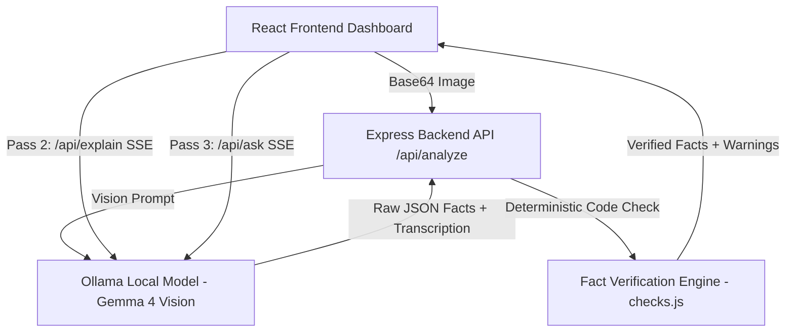

# DocSaathi

> **Your AI Document Companion for Deterministic Fact Verification & Multilingual Explanations**

Developed for **Hacktoberfest Hack Day — Coimbatore 2026** (INIT CLUB × iDEA CLUB in collaboration with Major League Hacking).

---

## Problem Statement

### The Problem
Millions of citizens in India face severe difficulties reading, understanding, and acting upon official paper documents such as electricity bills, municipal notices, traffic e-challans, and hospital discharge summaries/prescriptions. Issues include:
- Complex legal and technical jargon.
- Documents printed exclusively in English or formal administrative language.
- Critical deadlines (due dates, court summons warnings, disconnection threats) missed due to reading barriers.
- Medication dosage and dietary instructions misread, posing health hazards.

### Why We Chose This Problem
Existing OCR tools and generic LLMs often hallucinate dates, amounts, or account numbers. DocSaathi bridges this gap with a core guiding philosophy: **"Code handles facts, the model handles language."**

---

## Solution & Key Features

DocSaathi combines **Ollama Vision**, a **deterministic JavaScript verification engine**, and **real-time multilingual SSE streaming** into a high-performance React application.

### Key Features
1. **Pass 1: Vision Extraction & Code Fact Verification**:
   - Extracts transcription and structured fields.
   - Deterministic verification of verbatim text grounding, date math (days remaining / past due status), and amount calculations.
2. **Pass 2: Multilingual AI Explanation & Audio Reader**:
   - Real-time SSE streaming explanations in **9 regional Indian languages** (Tamil, Hindi, Malayalam, Telugu, Kannada, English, Bengali, Marathi, Gujarati).
   - Integrated Web Speech API **Audio Reader (Text-To-Speech)** so non-literate users can listen to explanations aloud in native accents.
   - Three operational modes: *Explain Simple*, *Key Summary*, and *Verbatim Translation*.
3. **Pass 3: Grounded Interactive Document Q&A Chat**:
   - Conversational assistant bound strictly to document transcription evidence with zero hallucination.
4. **Built-in Sample Documents**:
   - Preset SVG sample documents (TANGEDCO Electricity Bill, Kovai Hospital Prescription, Traffic E-Challan) for instant 1-click testing.

---

## Technical Implementation

### System Architecture


### Technology Stack
| Category | Technologies |
| --- | --- |
| **Frontend** | React 19, Vite, Lucide Icons, Web Speech API (TTS), Vanilla CSS Glassmorphism |
| **Backend** | Node.js, Express, Server-Sent Events (SSE), Native Fetch |
| **AI / ML** | Ollama local inference (`gemma4:latest` / Ollama Vision models) |

---

## Setup and Usage

### Prerequisites
- Node.js (v18+)
- Local Ollama instance running with a vision-capable model (e.g. `gemma4:latest`)

### Environment Setup
Create a `.env` file in `backend/`:
```env
PORT=5000
OLLAMA_URL=http://127.0.0.1:11434
MODEL=gemma4:latest
```

### Running the Backend & Frontend

1. **Start Backend Server:**
```bash
cd backend
npm install
npm start
```
*Backend runs on `http://localhost:5000`*

2. **Start React Frontend:**
```bash
cd frontend
npm install
npm run dev
```
*Frontend runs on `http://localhost:5173`*

---

## Open Source and AI Usage

- **Ollama**: Local AI model runner (`gemma4:latest`).
- **Express.js & CORS**: Lightweight REST API server with SSE support.
- **React & Vite**: Modern reactive frontend interface with Vite dev server proxying `/api` to port 5000.
- **Lucide React**: Clean icons for document types, verification status badges, and audio playback.

---

## License

MIT License. Developed for Hacktoberfest Hack Day Coimbatore 2026.